# Data Analyst – Securitisation | Days 1–5 Deliverable Package

**Project:** Securitisation Risk Assessment Dashboard (Power BI / DAX) — Zetheta Algorithms internship brief
**Scope of this package:** Day 1 (Domain Orientation), Day 2 (Data Architecture & Star Schema), Day 3 (Core DAX Measures, 30+), Day 4 (Time Intelligence), Day 5 (Advanced DAX & Virtual Tables)
**Data used:** `dpd_snapshot_history.csv`, `dynamic_loss_monthly.csv`, `static_pool_vintage_data.csv`

> **Scope note:** The brief also references a 500-loan, 50+ field auto loan data tape (`DimLoan` grain, with LTV, coupon, origination date, vehicle attributes). That file was not included in this upload. Every measure below that depends on it is explicitly marked **Pending Loan Tape** rather than filled in with invented numbers — the formula pattern is production-ready and will activate the moment that file is added, with no changes required.

---

## DAY 1 — Domain Orientation

### India's Securitisation Landscape (one-page summary)

India's securitisation market is built primarily on two structures: **Direct Assignment (DA)** (bilateral loan-pool sale, no SPV) and **Pass-Through Certificates (PTCs)** issued via a **Special Purpose Vehicle/Trust** to multiple investors. Auto loan, mortgage, and MSME/gold-loan pools are the dominant asset classes; NBFCs and HFCs are the largest originators, with banks as the main PTC investors (driven partly by Priority Sector Lending — PSL — requirements).

**Regulatory framework map:**

| Regulator | Instrument | What it governs |
|---|---|---|
| RBI | Master Direction – Reserve Bank of India (Securitisation of Standard Assets) Directions, 2021 (issued Sept 2021) | Minimum Retention Requirement (MRR), Minimum Holding Period (MHP), true-sale criteria, capital treatment of tranches, disclosure norms |
| RBI | Master Direction – RBI (Transfer of Loan Exposures) Directions, 2021 | Direct assignment transactions, co-lending |
| SEBI | SEBI (Issue and Listing of Securitised Debt Instruments) Regulations, 2008 (as amended) | Listing/disclosure for PTCs sold to the public, trustee obligations |
| Rating Agencies | CRISIL / ICRA / India Ratings criteria; global parity to S&P LEVELS, Moody's ABSNet/Idealised Default tables | Pool-level rating methodology, credit enhancement sizing, loss-curve benchmarking |
| RBI | IRAC norms (Income Recognition, Asset Classification) | SMA-0/1/2 → NPA classification (`RBI_SMA_Class` field in the data) — this is the *regulatory* asset-quality lens, distinct from the *accounting* IFRS 9 staging built on Day 9 |

**Data field mapping — what's present vs. what rating agencies require:**

| Data domain | Present in this upload | Required by S&P / Moody's / CRISIL but not yet provided |
|---|---|---|
| Loan performance (DPD, balances, flags) | ✅ `dpd_snapshot_history.csv` | — |
| Pool-level cash flow / loss roll-forward | ✅ `dynamic_loss_monthly.csv` | — |
| Static pool / vintage loss curves | ✅ `static_pool_vintage_data.csv` | — |
| Loan-level origination terms (coupon, term, origination date) | ❌ | Loan-level data tape |
| Collateral / vehicle attributes (make, model, LTV) | ❌ | Loan-level data tape |
| Borrower demographics / geography | ❌ | Loan-level data tape |
| Tranche structure & waterfall terms | ❌ | Deal term sheet (needed for Day 6) |

**Data quality finding (verify before treating any file as final):** `dpd_snapshot_history.csv` has exactly **1,000 rows for the 2024-05-30 snapshot instead of 500** (every `LoanID` appears twice). `dynamic_loss_monthly.csv` independently contains **two separate rows both dated 2024-05-30** (rows 5 and 6 of 12) — almost certainly the same labelling defect, where one row's true `ReportingDate` should be 2024-06-30. Both were de-duplicated (first-occurrence kept) before any cross-check number in this package was computed. This is exactly the kind of thing the brief means by "unverified AI output treated as final will be penalised" — flag it to whoever owns the source extract.

---

## DAY 2 — Data Architecture & Star Schema

### Star Schema Design

```mermaid
erDiagram
    DimDate ||--o{ FactMonthlyPerformance : "SnapshotDate"
    DimDate ||--o{ FactDynamicLoss : "ReportingDate"
    DimLoan ||--o{ FactMonthlyPerformance : "LoanID"
    DimVintage ||--o{ FactStaticPool : "VintageID"

    DimDate {
        date Date PK
        int Year
        string FiscalYear
        int FiscalQuarter
        string MonthName
        bool IsMonthEnd
    }
    DimLoan {
        string LoanID PK
        string PoolID
        string OriginationDate "pending loan tape"
        string InterestRate "pending loan tape"
        string LTV_Ratio "pending loan tape"
    }
    DimVintage {
        string VintageID PK
        date VintageStartDate
        int OriginalLoanCount
        decimal OriginalPoolBalance
    }
    FactMonthlyPerformance {
        date SnapshotDate FK
        string LoanID FK
        string PoolID
        int DPD_Days
        string DPD_Bucket
        string DPD_Bucket_Prior
        decimal CurrentBalance
        decimal AmountOverdue
        bool CureFlag
        bool WriteOffFlag
        string RBI_SMA_Class
        int ConsecutiveMonthsDelinquent
    }
    FactDynamicLoss {
        date ReportingDate FK
        int BOP_LoanCount
        decimal BOP_Balance
        decimal GrossLoss_ThisMonth
        decimal NetLoss_ThisMonth
        decimal Recoveries_ThisMonth
        decimal CollectionsTotal
        decimal CPR_Annualised
    }
    FactStaticPool {
        string VintageID FK
        int MonthsOnBook
        decimal CumulativeNetLoss
        decimal CumulativeNetLossRate
        decimal RemainingPoolBalance
        decimal PoolFactor
    }
```





**Table grain & role:**

| Table | Grain | Role |
|---|---|---|
| `DimDate` | One row per calendar date | Standard date dimension; drives all time intelligence. Built with an **Indian fiscal calendar** (FY starts April) since `TOTALYTD`/RBI reporting both use April–March. |
| `DimLoan` | One row per `LoanID` | Currently only `LoanID` + `PoolID` (derived from the 500 distinct loans in `dpd_snapshot_history.csv`). Origination/collateral/borrower attributes pending the loan tape. |
| `DimVintage` | One row per `VintageID` (15 vintages, 2021-Q1→2024-Q3) | Vintage-level static attributes: start date, original count, original balance. |
| `FactMonthlyPerformance` | One row per `LoanID` × `SnapshotDate` (500 loans × 11 months = 5,500 expected rows; see data quality finding above) | Loan-level monthly performance — DPD, balances, flags, RBI classification. Source: `dpd_snapshot_history.csv`. |
| `FactDynamicLoss` | One row per `ReportingDate` | Pool-level monthly roll-forward — BOP/EOP balance, defaults, losses, recoveries, prepayment, collection efficiency. Source: `dynamic_loss_monthly.csv`. |
| `FactStaticPool` | One row per `VintageID` × `MonthsOnBook` | Vintage cohort performance curve (cumulative default/loss/prepayment by seasoning month). Source: `static_pool_vintage_data.csv`. |

**Relationships (all single-direction, one-to-many, from Dim to Fact):**
- `DimDate[Date]` (1) → `FactMonthlyPerformance[SnapshotDate]` (*)
- `DimDate[Date]` (1) → `FactDynamicLoss[ReportingDate]` (*)
- `DimLoan[LoanID]` (1) → `FactMonthlyPerformance[LoanID]` (*)
- `DimVintage[VintageID]` (1) → `FactStaticPool[VintageID]` (*)

**Role-playing dimension note:** the brief specifies origination date vs. reporting date as a role-playing `DimDate` pattern. That requires `DimLoan[OriginationDate]`, which isn't in this upload — once added, mark the relationship **inactive** and activate it only inside specific measures with `USERELATIONSHIP( DimLoan[OriginationDate], DimDate[Date] )`, e.g. for vintage-cut seasoning measures that must ignore the active `SnapshotDate` relationship.

**DimDate fiscal calendar logic (build this as a calculated table or Power Query):**
```dax
DimDate =
ADDCOLUMNS (
    CALENDAR ( DATE(2021,1,1), DATE(2026,12,31) ),
    "Year", YEAR ( [Date] ),
    "FiscalYear",
        VAR CY = YEAR ( [Date] )
        VAR FYStart = IF ( MONTH ( [Date] ) >= 4, CY, CY - 1 )
        RETURN "FY" & FORMAT ( FYStart + 1, "00" )
    ,
    "FiscalQuarter",
        VAR M = MONTH ( [Date] )
        RETURN SWITCH ( TRUE(), M >= 4 && M <= 6, 1, M >= 7 && M <= 9, 2, M >= 10 && M <= 12, 3, 4 )
    ,
    "MonthName", FORMAT ( [Date], "MMM-YYYY" ),
    "IsMonthEnd", [Date] = EOMONTH ( [Date], 0 )
)
```

---

## DAY 3 — Core DAX Measures (30+)


### Day 3 Measures

#### Pool Balance

**Total Outstanding Balance**   
*Sum of current principal outstanding across the pool as of the reporting/snapshot date in filter context.*  
Table(s): `FactMonthlyPerformance`

```dax
Total Outstanding Balance =
SUM ( FactMonthlyPerformance[CurrentBalance] )
```

**Total Overdue Amount**   
*Total amount past due across all loans; numerator for delinquency severity ratios.*  
Table(s): `FactMonthlyPerformance`

```dax
Total Overdue Amount =
SUM ( FactMonthlyPerformance[AmountOverdue] )
```

**Original Pool Balance**   
*Aggregate original balance at securitisation cut-off, summed across all origination vintages.*  
Table(s): `DimVintage`

```dax
Original Pool Balance =
SUM ( DimVintage[OriginalPoolBalance] )
```

**Pool Factor**   
*Proportion of original pool balance remaining; core investor-reporting metric for amortisation tracking.*  
Table(s): `FactMonthlyPerformance, DimVintage`

```dax
Pool Factor =
DIVIDE ( [Total Outstanding Balance], [Original Pool Balance] )
```

**Net Performing Balance**   
*Outstanding balance excluding loans 30+ days past due; a cleaner base for performing-asset yield calcs.*  
Table(s): `FactMonthlyPerformance`

```dax
Net Performing Balance =
[Total Outstanding Balance] - [Total Delinquent Balance (30+ DPD)]
```

#### Count

**Active Loan Count**   
*Number of loans present in the pool at the current filter context (reporting date).*  
Table(s): `FactMonthlyPerformance`

```dax
Active Loan Count =
DISTINCTCOUNT ( FactMonthlyPerformance[LoanID] )
```

**Current Loans Count**   
*Count of loans with zero days past due — used for portfolio health headline KPI.*  
Table(s): `FactMonthlyPerformance`

```dax
Current Loans Count =
CALCULATE ( [Active Loan Count], FactMonthlyPerformance[DPD_Bucket] = "Current" )
```

**Defaulted Loans Count**   
*Count of loans classified as Default in the current period.*  
Table(s): `FactMonthlyPerformance`

```dax
Defaulted Loans Count =
CALCULATE ( [Active Loan Count], FactMonthlyPerformance[DPD_Bucket] = "Default" )
```

**Repossessed Loans Count**   
*Count of loans where collateral has been repossessed — feeds recovery/LGD analysis.*  
Table(s): `FactMonthlyPerformance`

```dax
Repossessed Loans Count =
CALCULATE ( [Active Loan Count], FactMonthlyPerformance[DPD_Bucket] = "Repossessed" )
```

**Written-Off Loans Count**   
*Count of loans written off in/at the current period — irrecoverable balance indicator.*  
Table(s): `FactMonthlyPerformance`

```dax
Written-Off Loans Count =
CALCULATE ( [Active Loan Count], FactMonthlyPerformance[WriteOffFlag] = TRUE )
```

**Cured Loans Count**   
*Loans that moved back to a better DPD bucket this period — numerator for cure rate.*  
Table(s): `FactMonthlyPerformance`

```dax
Cured Loans Count =
CALCULATE ( [Active Loan Count], FactMonthlyPerformance[CureFlag] = TRUE )
```

**Cure Rate %**   
*Share of previously-delinquent loans that cured in the current period.*  
Table(s): `FactMonthlyPerformance`

```dax
Cure Rate % =
DIVIDE (
    [Cured Loans Count],
    CALCULATE ( [Active Loan Count], FactMonthlyPerformance[DPD_Bucket_Prior] <> "Current" )
)
```

#### Delinquency Buckets

**Current Bucket Balance**   
*Balance with zero DPD.*  
Table(s): `FactMonthlyPerformance`

```dax
Current Bucket Balance =
CALCULATE ( [Total Outstanding Balance], FactMonthlyPerformance[DPD_Bucket] = "Current" )
```

**DPD 1-29 Balance**   
*Early-stage delinquency balance (RBI SMA-0 range).*  
Table(s): `FactMonthlyPerformance`

```dax
DPD 1-29 Balance =
CALCULATE ( [Total Outstanding Balance], FactMonthlyPerformance[DPD_Bucket] = "1-29 DPD" )
```

**DPD 30-59 Balance**   
*SMA-1 range balance.*  
Table(s): `FactMonthlyPerformance`

```dax
DPD 30-59 Balance =
CALCULATE ( [Total Outstanding Balance], FactMonthlyPerformance[DPD_Bucket] = "30-59 DPD" )
```

**DPD 60-89 Balance**   
*SMA-2 range balance.*  
Table(s): `FactMonthlyPerformance`

```dax
DPD 60-89 Balance =
CALCULATE ( [Total Outstanding Balance], FactMonthlyPerformance[DPD_Bucket] = "60-89 DPD" )
```

**DPD 90-119 Balance**   
*Early NPA-range balance (IFRS 9 Stage 2/3 boundary).*  
Table(s): `FactMonthlyPerformance`

```dax
DPD 90-119 Balance =
CALCULATE ( [Total Outstanding Balance], FactMonthlyPerformance[DPD_Bucket] = "90-119 DPD" )
```

**DPD 120+ Balance**   
*Deep delinquency balance, IFRS 9 Stage 3 candidate.*  
Table(s): `FactMonthlyPerformance`

```dax
DPD 120+ Balance =
CALCULATE ( [Total Outstanding Balance], FactMonthlyPerformance[DPD_Bucket] = "120+ DPD" )
```

**Total Delinquent Balance (30+ DPD)**   
*Aggregated 30-days-plus delinquent balance — the standard rating-agency delinquency headline.*  
Table(s): `FactMonthlyPerformance`

```dax
Total Delinquent Balance (30+ DPD) =
CALCULATE (
    [Total Outstanding Balance],
    FactMonthlyPerformance[DPD_Bucket] IN
        { "30-59 DPD", "60-89 DPD", "90-119 DPD", "120+ DPD", "Default" }
)
```

**% Delinquent 30+ (by balance)**   
*Delinquency ratio for trigger monitoring and investor reports.*  
Table(s): `FactMonthlyPerformance`

```dax
% Delinquent 30+ (by balance) =
DIVIDE ( [Total Delinquent Balance (30+ DPD)], [Total Outstanding Balance] )
```

**NPA Balance (RBI SMA Class)**   
*Balance classified NPA under RBI's IRAC norms — regulatory (not IFRS9) asset-quality view.*  
Table(s): `FactMonthlyPerformance`

```dax
NPA Balance (RBI SMA Class) =
CALCULATE ( [Total Outstanding Balance], FactMonthlyPerformance[RBI_SMA_Class] = "NPA" )
```

**Gross NPA Ratio**   
*RBI-reportable Gross NPA % — distinct from the IFRS 9 stage-based ECL view built on Day 9.*  
Table(s): `FactMonthlyPerformance`

```dax
Gross NPA Ratio =
DIVIDE ( [NPA Balance (RBI SMA Class)], [Total Outstanding Balance] )
```

**SMA-2 Balance**   
*Balance one step before NPA classification under RBI norms — early warning trigger.*  
Table(s): `FactMonthlyPerformance`

```dax
SMA-2 Balance =
CALCULATE ( [Total Outstanding Balance], FactMonthlyPerformance[RBI_SMA_Class] = "SMA-2" )
```

#### Weighted Averages

**Weighted Avg DPD**   
*Balance-weighted average days-past-due — a single portfolio-health scalar for trend charts.*  
Table(s): `FactMonthlyPerformance`

```dax
Weighted Avg DPD =
DIVIDE (
    SUMX ( FactMonthlyPerformance, FactMonthlyPerformance[CurrentBalance] * FactMonthlyPerformance[DPD_Days] ),
    [Total Outstanding Balance]
)
```

**Weighted Avg Consecutive Months Delinquent**   
*Weighted chronicity of delinquency — distinguishes long-term stress from a one-off missed EMI.*  
Table(s): `FactMonthlyPerformance`

```dax
Weighted Avg Consecutive Months Delinquent =
DIVIDE (
    SUMX ( FactMonthlyPerformance, FactMonthlyPerformance[CurrentBalance] * FactMonthlyPerformance[ConsecutiveMonthsDelinquent] ),
    [Total Outstanding Balance]
)
```

**WAC (Weighted Average Coupon)** 🟡 *Pending Loan Tape*  
*Weighted average contractual coupon — needed for excess-spread and WAC-WAS calcs.*  
Table(s): `DimLoan (loan tape)`

```dax
WAC =
DIVIDE (
    SUMX ( DimLoan, DimLoan[CurrentBalance] * DimLoan[InterestRate] ),
    SUM ( DimLoan[CurrentBalance] )
)
```

**WALA (Weighted Avg Loan Age)** 🟡 *Pending Loan Tape*  
*Weighted average seasoning of the pool in months.*  
Table(s): `DimLoan (loan tape)`

```dax
WALA =
DIVIDE (
    SUMX ( DimLoan, DimLoan[CurrentBalance] * DATEDIFF ( DimLoan[OriginationDate], TODAY(), MONTH ) ),
    SUM ( DimLoan[CurrentBalance] )
)
```

**WALT / WAM (Weighted Avg Remaining Term)** 🟡 *Pending Loan Tape*  
*Weighted average remaining maturity — drives tranche average life estimates.*  
Table(s): `DimLoan (loan tape)`

```dax
WAM =
DIVIDE (
    SUMX ( DimLoan, DimLoan[CurrentBalance] * DimLoan[RemainingTermMonths] ),
    SUM ( DimLoan[CurrentBalance] )
)
```

**Weighted Average LTV** 🟡 *Pending Loan Tape*  
*Collateral coverage measure — key residual-value/LGD driver for auto ABS.*  
Table(s): `DimLoan (loan tape)`

```dax
Weighted Average LTV =
DIVIDE (
    SUMX ( DimLoan, DimLoan[CurrentBalance] * DimLoan[LTV_Ratio] ),
    SUM ( DimLoan[CurrentBalance] )
)
```

#### Vintage / Pool

**Original Loan Count (All Vintages)**   
*Total loans originated across all vintages — denominator for cumulative default-rate measures.*  
Table(s): `DimVintage`

```dax
Original Loan Count (All Vintages) =
SUM ( DimVintage[OriginalLoanCount] )
```

**Weighted Avg Seasoning (Static Pool)**   
*Weighted seasoning across vintages, taking only the latest observed MonthsOnBook row per vintage (the fact table stores a full curve per vintage, so a naive SUMX over all rows would double count).*  
Table(s): `FactStaticPool`

```dax
Weighted Avg Seasoning (Static Pool) =
VAR CurrentSlice =
    FILTER (
        FactStaticPool,
        FactStaticPool[MonthsOnBook]
            = CALCULATE ( MAX ( FactStaticPool[MonthsOnBook] ), ALLEXCEPT ( FactStaticPool, FactStaticPool[VintageID] ) )
    )
RETURN
    DIVIDE (
        SUMX ( CurrentSlice, FactStaticPool[RemainingPoolBalance] * FactStaticPool[MonthsOnBook] ),
        SUMX ( CurrentSlice, FactStaticPool[RemainingPoolBalance] )
    )
```

#### Loss & Recovery

**Monthly Gross Loss**   
*Gross charge-offs for the period, pre-recovery.*  
Table(s): `FactDynamicLoss`

```dax
Monthly Gross Loss =
SUM ( FactDynamicLoss[GrossLoss_ThisMonth] )
```

**Monthly Net Loss**   
*Gross loss net of recoveries — the number that erodes credit enhancement.*  
Table(s): `FactDynamicLoss`

```dax
Monthly Net Loss =
SUM ( FactDynamicLoss[NetLoss_ThisMonth] )
```

**Monthly Recoveries**   
*Cash recovered on defaulted/repossessed accounts in the period.*  
Table(s): `FactDynamicLoss`

```dax
Monthly Recoveries =
SUM ( FactDynamicLoss[Recoveries_ThisMonth] )
```

**Recovery Rate**   
*Recoveries as % of gross loss — 1 minus this feeds LGD.*  
Table(s): `FactDynamicLoss`

```dax
Recovery Rate =
DIVIDE ( [Monthly Recoveries], [Monthly Gross Loss] )
```

**Collection Efficiency**   
*Collections realised vs. billed — servicer performance KPI. Values >100% reflect prior-period arrears collected in the current month.*  
Table(s): `FactDynamicLoss`

```dax
Collection Efficiency =
DIVIDE ( SUM ( FactDynamicLoss[CollectionsTotal] ), SUM ( FactDynamicLoss[BillingAmount] ) )
```

#### Prepayment

**Monthly SMM**   
*Single Monthly Mortality — prepayment speed for the period.*  
Table(s): `FactDynamicLoss`

```dax
Monthly SMM =
AVERAGE ( FactDynamicLoss[SMM] )
```

**CPR (Annualised)**   
*Conditional Prepayment Rate, annualised — investor cash-flow projection input.*  
Table(s): `FactDynamicLoss`

```dax
CPR (Annualised) =
AVERAGE ( FactDynamicLoss[CPR_Annualised] )
```

#### Yield

**Excess Spread**   
*WAC minus servicing/senior costs minus losses — the first loss-absorption buffer before hitting credit enhancement.*  
Table(s): `FactDynamicLoss`

```dax
Excess Spread =
SUM ( FactDynamicLoss[ExcessSpread_Monthly] )
```


---

## DAY 4 — Time Intelligence & Trend Analysis

### Day 4 Measures

#### Time Intelligence

**Net Loss YTD (Indian FY)**   
*Year-to-date net loss on an April-March Indian fiscal calendar.*  
Table(s): `FactDynamicLoss, DimDate`

```dax
Net Loss YTD (Indian FY) =
TOTALYTD ( [Monthly Net Loss], DimDate[Date], "3/31" )
```

**Gross Loss YTD (Indian FY)**   
*YTD gross charge-offs on Indian fiscal calendar.*  
Table(s): `FactDynamicLoss, DimDate`

```dax
Gross Loss YTD (Indian FY) =
TOTALYTD ( [Monthly Gross Loss], DimDate[Date], "3/31" )
```

**Collections QTD**   
*Quarter-to-date collections for servicer reporting.*  
Table(s): `FactDynamicLoss, DimDate`

```dax
Collections QTD =
TOTALQTD ( SUM ( FactDynamicLoss[CollectionsTotal] ), DimDate[Date] )
```

**New Defaults MTD**   
*Month-to-date newly defaulted balance.*  
Table(s): `FactDynamicLoss, DimDate`

```dax
New Defaults MTD =
CALCULATE (
    SUM ( FactDynamicLoss[NewDefaults_Balance] ),
    DATESMTD ( DimDate[Date] )
)
```

**Rolling 3-Month Avg Net Loss Rate**   
*Smooths month-to-month noise in the net loss rate for trend charts.*  
Table(s): `FactDynamicLoss, DimDate`

```dax
Rolling 3-Month Avg Net Loss Rate =
AVERAGEX (
    DATESINPERIOD ( DimDate[Date], MAX ( DimDate[Date] ), -3, MONTH ),
    CALCULATE ( [Monthly Net Loss Rate] )
)
```

**Rolling 12-Month Avg Net Loss Rate**   
*Baseline trailing-12-month loss rate; also the mean used in the trend-deviation alert.*  
Table(s): `FactDynamicLoss, DimDate`

```dax
Rolling 12-Month Avg Net Loss Rate =
AVERAGEX (
    DATESINPERIOD ( DimDate[Date], MAX ( DimDate[Date] ), -12, MONTH ),
    CALCULATE ( [Monthly Net Loss Rate] )
)
```

**Net Loss Rate vs Prior Month**   
*Period-over-period change, MoM.*  
Table(s): `FactDynamicLoss, DimDate`

```dax
Net Loss Rate vs Prior Month =
[Monthly Net Loss Rate] -
CALCULATE ( [Monthly Net Loss Rate], DATEADD ( DimDate[Date], -1, MONTH ) )
```

**Net Loss Rate vs Prior Quarter**   
*Period-over-period change, QoQ.*  
Table(s): `FactDynamicLoss, DimDate`

```dax
Net Loss Rate vs Prior Quarter =
[Monthly Net Loss Rate] -
CALCULATE ( [Monthly Net Loss Rate], DATEADD ( DimDate[Date], -1, QUARTER ) )
```

**Net Loss Rate vs Prior Year**   
*Period-over-period change, YoY.*  
Table(s): `FactDynamicLoss, DimDate`

```dax
Net Loss Rate vs Prior Year =
[Monthly Net Loss Rate] -
CALCULATE ( [Monthly Net Loss Rate], SAMEPERIODLASTYEAR ( DimDate[Date] ) )
```

**Trend Deviation Alert (2σ)**   
*Flags any month where the net loss rate moves more than 2 standard deviations from its trailing 12-month average — validated on real data: May-2024 and Jun-2024 both breach this threshold (z = 1.83 and -1.88).*  
Table(s): `FactDynamicLoss, DimDate`

```dax
Trend Deviation Alert (2σ) =
VAR CurrentRate = [Monthly Net Loss Rate]
VAR Avg12 = [Rolling 12-Month Avg Net Loss Rate]
VAR StdDev12 =
    STDEVX.P (
        DATESINPERIOD ( DimDate[Date], MAX ( DimDate[Date] ), -12, MONTH ),
        CALCULATE ( [Monthly Net Loss Rate] )
    )
VAR ZScore = DIVIDE ( CurrentRate - Avg12, StdDev12 )
RETURN
    IF ( ABS ( ZScore ) > 2, "⚠ ALERT: " & FORMAT ( ZScore, "0.00" ) & "σ", "Normal" )
```

**Collection Efficiency Rolling 3-Month**   
*Smoothed servicer collection performance trend.*  
Table(s): `FactDynamicLoss, DimDate`

```dax
Collection Efficiency Rolling 3-Month =
AVERAGEX (
    DATESINPERIOD ( DimDate[Date], MAX ( DimDate[Date] ), -3, MONTH ),
    CALCULATE ( [Collection Efficiency] )
)
```


---

## DAY 5 — Advanced DAX & Virtual Tables

### Day 5 Measures

#### Advanced / Stratification

**HHI (Herfindahl-Hirschman Index)**   
*Concentration index over loan-level balance shares (0-10,000 scale). Cross-checked against Python on the latest snapshot: HHI = 29.15 — very low single-name concentration, consistent with a granular 500-loan retail auto pool.*  
Table(s): `FactMonthlyPerformance`

```dax
HHI (Herfindahl-Hirschman Index) =
VAR LoanShares =
    ADDCOLUMNS (
        SUMMARIZE ( FactMonthlyPerformance, FactMonthlyPerformance[LoanID] ),
        "@Share", DIVIDE ( CALCULATE ( [Total Outstanding Balance] ), [Total Outstanding Balance] )
    )
RETURN
    SUMX ( LoanShares, [@Share] ^ 2 ) * 10000
```

**Top 10 Borrower Concentration %**   
*Largest-10-loan exposure as % of pool. Cross-checked: 6.46% on the latest snapshot.*  
Table(s): `FactMonthlyPerformance`

```dax
Top 10 Borrower Concentration % =
VAR LoanBalances =
    SUMMARIZE (
        FactMonthlyPerformance, FactMonthlyPerformance[LoanID],
        "@Bal", CALCULATE ( [Total Outstanding Balance] )
    )
VAR Top10 = TOPN ( 10, LoanBalances, [@Bal], DESC )
RETURN
    DIVIDE ( SUMX ( Top10, [@Bal] ), [Total Outstanding Balance] )
```

**Loan Balance Rank**   
*Ranks individual loans by current balance within the selected filter context — feeds top-N exposure tables.*  
Table(s): `FactMonthlyPerformance`

```dax
Loan Balance Rank =
RANKX ( ALLSELECTED ( FactMonthlyPerformance[LoanID] ), [Total Outstanding Balance] )
```

**Top 5 Vintage Loss Concentration**   
*Share of total cumulative net loss contributed by the 5 worst-performing vintages — surfaces vintage concentration risk.*  
Table(s): `FactStaticPool`

```dax
Top 5 Vintage Loss Concentration =
VAR VintageLoss =
    SUMMARIZE (
        FactStaticPool, FactStaticPool[VintageID],
        "@NetLoss", CALCULATE ( MAX ( FactStaticPool[CumulativeNetLoss] ) )
    )
VAR Top5 = TOPN ( 5, VintageLoss, [@NetLoss], DESC )
VAR TotalLoss = SUMX ( VintageLoss, [@NetLoss] )
RETURN
    DIVIDE ( SUMX ( Top5, [@NetLoss] ), TotalLoss )
```

**DPD Bucket Stratification Table**   
*Virtual table used as the source for the DPD stratification matrix visual (not a scalar KPI card — bind directly as a table visual).*  
Table(s): `FactMonthlyPerformance`

```dax
DPD Bucket Stratification Table (virtual table pattern) =
ADDCOLUMNS (
    SUMMARIZE ( FactMonthlyPerformance, FactMonthlyPerformance[DPD_Bucket] ),
    "@Balance", CALCULATE ( [Total Outstanding Balance] ),
    "@Count", CALCULATE ( [Active Loan Count] ),
    "@PctOfPool", DIVIDE ( CALCULATE ( [Total Outstanding Balance] ), [Total Outstanding Balance] )
)
```

**Vintage Stratification Table**   
*Vintage-level table for the Day 8 loss-curve comparison visual, built here as the Day 5 virtual-table pattern.*  
Table(s): `DimVintage, FactStaticPool`

```dax
Vintage Stratification Table (virtual table pattern) =
ADDCOLUMNS (
    SUMMARIZE ( DimVintage, DimVintage[VintageID] ),
    "@OrigBalance", CALCULATE ( SUM ( DimVintage[OriginalPoolBalance] ) ),
    "@LatestNetLossRate",
        CALCULATE (
            MAX ( FactStaticPool[CumulativeNetLossRate] ),
            FILTER (
                FactStaticPool,
                FactStaticPool[MonthsOnBook]
                    = CALCULATE ( MAX ( FactStaticPool[MonthsOnBook] ), ALLEXCEPT ( FactStaticPool, FactStaticPool[VintageID] ) )
            )
        )
)
```

**Portfolio-Level Net Loss (Context Transition Demo)**   
*Illustrates context transition: iterating VALUES(ReportingDate) in row context, then CALCULATE converts each row into its own filter context before summing — the same pattern the Day 9 ECL model uses per-loan (SUMX over Loans with CALCULATE(PD*LGD*EAD)). Result is identical to a plain SUM here since ReportingDate is already the fact grain; the pattern's value shows when iterating a higher grain than the fact table (e.g. iterating loans while the measure operates at pool level).*  
Table(s): `FactDynamicLoss`

```dax
Portfolio-Level Net Loss (Context Transition Demo) =
SUMX (
    VALUES ( FactDynamicLoss[ReportingDate] ),
    CALCULATE ( SUM ( FactDynamicLoss[NetLoss_ThisMonth] ) )
)
```


---

## Cross-Check Appendix (validated against the raw CSVs in Python — the DAX above should reproduce these)

| Metric | Value | As of |
|---|---|---|
| Total Outstanding Balance | ₹36,14,69,006 (≈ ₹361.5 mn) | 2024-10-30 |
| Active Loan Count | 500 | 2024-10-30 |
| % Delinquent 30+ (by balance) | 13.66% | 2024-10-30 |
| Gross NPA Ratio (RBI SMA Class = NPA) | 5.78% | 2024-10-30 |
| SMA-0 / SMA-1 / SMA-2 (by balance) | 6.83% / 3.94% / 4.64% | 2024-10-30 |
| HHI (loan-level balance concentration) | 29.15 (very low — highly granular retail pool) | 2024-10-30 |
| Top-10 Borrower Concentration | 6.46% | 2024-10-30 |
| Rolling 3-Month Avg Net Loss Rate | 0.093% | 2024-10-30 |
| Trend Deviation Alert (2σ) breaches | May-2024 (z = +1.83), Jun-2024 (z = −1.88) | trailing 12-mo, after de-duplication |
| Average annualised CPR | 8.99% | trailing 11 months |
| Average Collection Efficiency | 128.4% (range 110.2%–144.2%) | trailing 11 months — >100% because prior-period arrears are being collected alongside current billing |

**Roll rate matrix (all observed transitions, row = prior bucket, column = current bucket, row %):**

| From ＼ To | 1-29 DPD | 30-59 DPD | 60-89 DPD | 90-119 DPD | 120+ DPD | Current | Default | Repossessed |
|---|---|---|---|---|---|---|---|---|
| **1-29 DPD** | 42.2% | 4.6% | – | – | – | 53.2% | – | – |
| **30-59 DPD** | – | 47.7% | 52.3% | – | – | – | – | – |
| **60-89 DPD** | – | – | 62.8% | 27.9% | 9.3% | – | – | – |
| **90-119 DPD** | – | – | – | 76.2% | 12.7% | – | 9.5% | 1.6% |
| **120+ DPD** | – | – | – | – | 86.7% | – | 6.7% | 6.7% |
| **Current** | 5.7% | 0.6% | 0.4% | – | – | 93.3% | – | – |
| **Default** | – | – | – | – | – | – | 100% | – |

This is exactly the source table the Day 5 `DPD Bucket Stratification Table` virtual-table pattern should reproduce when pivoted in Power BI (row = `DPD_Bucket_Prior`, column = `DPD_Bucket`, value = row-normalised loan count).

---

## What's next (Days 6–15, not in this package)
Day 6 (waterfall/tranche allocation) and Day 9 (IFRS 9 ECL) both need the **roll rate matrix above as the PD term-structure input** and **tranche/deal terms** (not yet provided) to be built correctly rather than assumed — flag if you want those built next.
